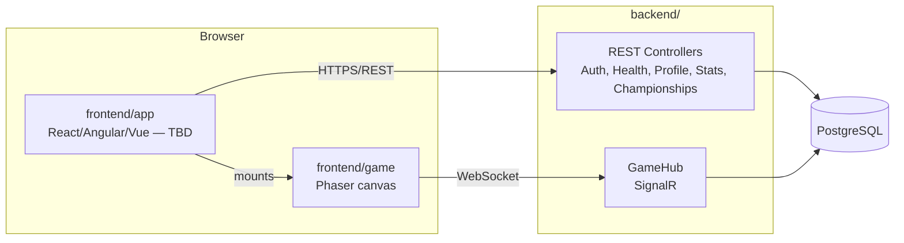

# Tank It! — Game Design Document

Status: **living document**, supersedes `PROPOSAL.pdf` (kept at the repo root for history).
Update this file — not Discord — whenever a decision changes; the "why" belongs here so it
survives past the person who made the call.

ft_transcendence project. Team: hebatist, aneri-da, vfidelis, lbarreto, gada-sil.

## 1. Concept

**Tank It!** — a browser-based tank battle royale (2–4 players). Pun: the game is about tanks,
and tank controls are notoriously hard to master, so — can you tank it?

Built with **Phaser** for the game core, a companion landing page for accounts/matchmaking/
rankings, real-time online multiplayer, and a rule-based AI opponent for solo/practice play.

### Core gameplay

| Feature | Status | Notes |
|---|---|---|
| Tank movement and aiming | ✅ Implemented | Local, tank-style controls. |
| Firing projectiles (destroy walls, barrels, tanks) | ✅ Implemented | |
| Win condition: last tank standing | ✅ Implemented | |
| Ammo gauge (5 shots, ~8s refill when empty) | ✅ Implemented | Per-tank, shown on-screen sides. |
| Shrinking map (contracts after 3 min, outside-in) | 🔲 To build | Explosion/fire visual as it contracts. |
| Online multiplayer | 🔲 To build | Replaces local-only play; SignalR (`backend/`). |
| Landing page (register/login, rooms, rankings) | 🔲 To build | `frontend/app/` — framework TBD. |
| AI opponent (solo/practice) | 🔲 To build | Rule-based, not ML. Reuses existing game loop. |
| Championship mode (FT-N) | 🔲 To build | Best-of-series race to a target score. See §6. |

## 2. Team organization & roles

| Role | Owner | What they own |
|---|---|---|
| Product Owner | **hebatist** | Feature backlog, priority order, "done" criteria for gameplay features, tie-breaker on product disagreements. |
| Technical Lead / Architect | **aneri-da** | Architecture (game loop, netcode, backend split), stack call, reviews critical PRs (netcode, DB schema, auth). Stays hands-on in code. |
| Project Manager / Scrum Master | **vfidelis** | Runs the weekly sync, keeps the board current, chases blockers, tracks who owes what. |
| Developers | **lbarreto**, **gada-sil** (+ all of the above) | Implement features/modules. Every PR needs 1 review before merging to `main`. |

Work-area fit (not a rigid assignment — a prompt for who volunteers where):

| Area | Covers |
|---|---|
| Game core (Phaser) | Ammo gauge, shrinking map, AI opponent, game feel |
| Multiplayer / backend | SignalR sync, matchmaking, room lifecycle, EF Core/Postgres |
| Landing page & user management | Auth, profile, friends, rankings UI |
| DevOps / infra | Docker Compose, CI, health check |

## 3. Working practices

| Practice | How |
|---|---|
| Regular communication | Weekly sync **Tuesday evening**, in person or online; async Discord for daily blockers. |
| Task organization | GitHub Issues + GitHub Project board (To Do / In Progress / Review / Done). No second tool. |
| Work breakdown | Backlog split into issues per feature/module, each ≤ 2–3 days. |
| Code reviews | Branch-per-feature, ≥1 approval required before merging to `main`, no direct pushes to `main`. |
| Documentation | Decisions and "why" live in this repo (README/GDD/docs), not just Discord. |
| Communication channel | Discord: `#general`, `#backend`, `#game`, `#frontend`, `#devops`. |
| Commit convention | `feat:`, `fix:`, `chore:` prefixes. |
| Definition of Done | Works locally, reviewed, no console errors/warnings. |

## 4. Technical stack

### 4.1 Game core
**Phaser** (TypeScript, Vite) — already in progress, lives in `frontend/game/`. Decided from
project start, no debate needed.

### 4.2 Frontend shell (landing page)
**Not yet decided** — Pure React, Angular, or Vue. All three satisfy the subject's frontend-
framework requirement equally; picked by whoever takes ownership of `frontend/app/`, based on
team familiarity rather than module scoring. See `frontend/app/README.md`.

### 4.3 Backend
**ASP.NET Core (C#)**, decided over Spring Boot and Ruby on Rails.

**Why:** the game needs low-latency tank-position sync across rooms of 2–4 players, and the
subject's Remote Players module explicitly requires handling disconnection/reconnection
gracefully. **SignalR** gives real-time groups, automatic reconnection, and transport fallback
out of the box — the other two candidates need that wiring built by hand (`spring-websocket`/
STOMP) or bolted on as a second service (Rails' Action Cable isn't built for high-frequency
per-room tick updates). Rails would have been faster for the CRUD/auth side of the landing
page, but that trade would mean maintaining two backends — not worth it for a 5-person team on
a fixed deadline. EF Core (ORM) and ASP.NET Identity (auth/OAuth) are mature enough to keep the
CRUD side reasonably fast anyway.

### 4.4 Database
**PostgreSQL**. Schema covers the committed modules (auth, OAuth, friends, matches, match
history, aggregate stats) — see `docs/database-schema.md` for the full ERD and rationale, and
`db/init/schema.sql` for the DDL.

### 4.5 Infra
Docker Compose (`docker-compose.yml`) — Postgres + backend today; a `frontend` service is
stubbed in, ready to uncomment once `frontend/app/` has a Dockerfile. Single-command bring-up
is the target once the frontend framework lands.

## 5. Modules & points plan

Target was 14 minimum; committed scope reaches **18**, a healthy buffer without chasing every
available module.

### 5.1 Free (fall out of the game we're already building)

| Category | Module | Type | Pts |
|---|---|---|---|
| Gaming & UX | Complete web-based game | Major | 2 |
| Gaming & UX | Remote players | Major | 2 |
| Gaming & UX | Multiplayer 3+ players | Major | 2 |
| Web | Real-time features (WebSockets) | Major | 2 |
| Web | Frontend + backend framework | Major | 2 |
| | **Subtotal** | | **10** |

### 5.2 Committed to cross the floor

| Category | Module | Type | Pts | Notes |
|---|---|---|---|---|
| User Management | Standard user management & auth | Major | 2 | Profile, avatar, friends, online status. |
| Artificial Intelligence | AI Opponent | Major | 2 | Rule-based bot tank, solo/practice play. No new infra. |
| | **Running total** | | **14** | |

### 5.3 Committed buffer modules

| Category | Module | Type | Pts | Notes |
|---|---|---|---|---|
| User Management | Game stats & match history | Minor | 1 | |
| User Management | Remote auth (OAuth 2.0: Google/GitHub/42) | Minor | 1 | |
| DevOps | Health check / status page + backups | Minor | 1 | |
| Gaming & UX | Tournament system | Minor | 1 | Delivered as the Championship/FT-N mode (§6) — a fixed-roster race to a target score, not a bracket, but satisfies the module. |
| | **Buffer subtotal** | | **4** | |

**Total: 18 points.**

Explicitly **not** committed (available later if velocity allows, but not planned for): chat +
profile + friends (Major, 2pt), Gamification/achievements/leaderboard (Minor, 1pt). If scope
changes, extend both this table and `docs/database-schema.md` together rather than improvising.

**Excluded outright** (per team direction, not revisited): Accessibility & Internationalization,
Cybersecurity, Blockchain.

## 6. Championship mode (FT-N)

Players can play a **single match** or enter a **championship**: a fixed-roster series of
matches racing to a target score, first to reach it wins. Same lobby size (2–4) and same
players for every match in the series — no substitutions mid-championship. AI opponents are
allowed, so a solo player can run a championship against bots for practice.

### Scoring (your rule, generalized)

For an N-player match: **1st to die scores 0, ..., winner scores N−1.** A 4-player match is
exactly your spec (0/1/2/3); this generalizes cleanly to 3-player (0/1/2) and 2-player (0/1)
matches — same underlying rule, just scaled to the lobby size.

### Target score by roster size

| Players | Format | Target |
|---|---|---|
| 4 | FT10 | 10 |
| 3 | FT7 | 7 |
| 2 | FT5 | 5 |

### Win condition

After every match, cumulative points are re-checked for all participants. First to reach the
target wins the championship immediately — the series doesn't run a fixed number of matches.
If two participants cross the target in the *same* match (the only way it can happen, since
the check runs once per completed match) with **different totals**, the higher total wins
outright — your example: dark reaches 11, green reaches 12 in the same match, green is
champion, no tie-break needed.

### Tie-break (exact tie only — same total, at or above target, in the same deciding match)

1. **More kills**, summed across the championship's matches.
2. **More matches won** (placement = 1), across the championship's matches.
3. **Head-to-head** — pairwise, how many times one tied player placed better than the other
   across the matches they shared. *(Not "who scored more combined points in shared matches"
   — tested that against a real database while building this: in a fixed-roster championship
   every match is shared, so that number is always identical to the tied total and resolves
   nothing.)*
4. **Sudden-death decider match** — *added here as a deterministic last resort, not something
   you explicitly asked for; flag if you'd rather leave a triple-tie undefined or handle it
   some other way.* If still tied after all three criteria above — which is reachable, not just
   theoretical: two players can genuinely split their head-to-head record evenly — the tied
   players play one more match. Its winner is champion outright.

Full query definitions (validated against a real Postgres instance) are in
`docs/database-schema.md` under "Championship mode (FT-N)".

## 7. Architecture overview



REST handles account/profile/friends/stats CRUD; SignalR (`/hubs/game`) handles room lifecycle
and in-match tank/projectile sync. Both sides read/write the same Postgres instance through EF
Core.

## 8. Repository structure

```
tanks_project/
├── docs/
│   ├── GDD.md                  this document
│   └── database-schema.md      ERD + schema rationale
├── db/
│   └── init/schema.sql         Postgres DDL (bootstrap; EF migrations take over later)
├── frontend/
│   ├── game/                   Phaser game core (TypeScript, Vite) — implemented
│   └── app/                    SPA shell — framework TBD, owner scaffolds it here
├── backend/
│   ├── TankIt.sln
│   └── src/TankIt.Api/         ASP.NET Core API + SignalR hub (skeleton, not yet buildable —
│                                see backend/README.md for what's missing)
├── docker-compose.yml
├── .env.example
└── PROPOSAL.pdf                original discussion draft, kept for history
```

## 9. Open items

1. Pick the frontend framework (React / Angular / Vue) — owner scaffolds `frontend/app/`.
2. Scaffold the backend for real once a `dotnet` SDK is available (`dotnet restore`, first EF
   Core migration) — see `backend/README.md`.
3. Wire ASP.NET Identity + JWT + OAuth per `backend/src/TankIt.Api/Controllers/AuthController.cs`.
4. Implement `GameHub`'s real-time contract (tank move/fire sync, reconnection handling).
5. Build the shrinking-map mechanic and AI opponent in `frontend/game/`.
6. Implement championship lifecycle (create/join, sequencing matches, standings + tie-break,
   decider-match trigger) per `backend/src/TankIt.Api/Controllers/ChampionshipController.cs`.
7. Confirm the sudden-death decider-match fallback (§6) — flagged as an addition, not an
   explicit team decision.
